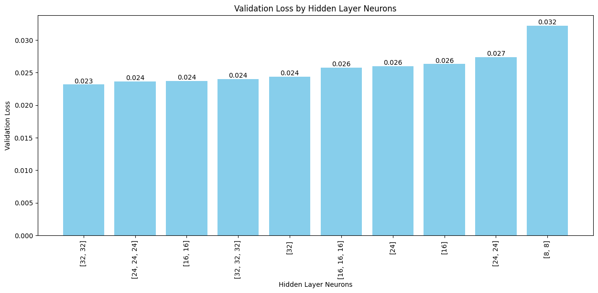

# TensorFlow FCNN Hyperparameter Tuner

This repository provides a versatile function for generating, training, and evaluating Fully Connected Neural Networks (FCNN) with a variety of hyperparameters in TensorFlow. The function enables users to experiment with different model architectures, learning rates, regularization settings, and batch normalization options, making it ideal for hyperparameter tuning and architecture optimization in both classification and regression tasks. Intelligent model skipping is implemented to eliminate configurations likely to underperform, enhancing efficiency.

## Key Features

- **Customizable Network Architectures**: Define unique model architectures with various combinations of hidden layers and neurons using `neuron_combinations_array`.
- **Adaptable to Task Type**: Specify either `'classification'` or `'regression'` for the model task, with adjustments in output layers and performance metrics.
- **Batch Normalization**: Toggle batch normalization to generate models both with and without batch normalization layers for deeper networks.
- **L2 Regularization**: Prevent overfitting with configurable L2 regularization strengths.
- **Efficient Hyperparameter Skipping**: Skip configurations that are likely to underperform using the `smart_skipping` feature, based on insights from previous model performance.
- **ReLU and Adam**: Uses the ReLU activation for hidden layers and the Adam optimizer for stable training across configurations.

## Function Signature

```python
def hyperparam_tuner(
    X_train, y_train, 
    X_val, y_val, 
    total_outputs, 
    neuron_combinations_array, 
    loss_func, 
    task, 
    learning_rates=[1., 0.1, 0.01, 0.001, 0.0001],
    lr_decay=1,
    reg_lambdas=[1., 0.1, 0.01, 0.001, 0.0001], 
    epochs=50, 
    batch_size=128, 
    batch_norm=True, 
    smart_skipping=True, 
    verbose=0
)
```
### Parameters

- **X_train, y_train**: Training data (features and labels).
- **X_val, y_val**: Validation data (features and labels).
- **total_outputs**: Number of output units (for classification, equals the number of classes).
- **neuron_combinations_array**: Specifies different configurations of neurons for each hidden layer. For example:

    ```python
    neuron_combinations_array = [
        [[2], [4], [8]],           # One hidden layer networks with 2, 4, and 8 neurons
        [[16, 8], [8, 8], [8, 4]]  # Two hidden layers networks with [16, 8], [8, 8], and [8, 4] neurons
    ]
    ```
  
- **loss_func**: The loss function to use, e.g., `'tf.keras.losses.SparseCategoricalCrossentropy(from_logits=True)'` for classification.
- **task**: Specify either `'classification'` or `'regression'` to control output and evaluation metrics.
- **learning_rates**: A list of learning rates to iterate over.
- **lr_decay**: Coefficient for decaying learning rate after every epoch.
- **reg_lambdas**: A list of L2 regularization strengths.
- **epochs**: Number of training epochs.
- **batch_size**: Number of samples per batch.
- **batch_norm**: When `True`, generates models with and without batch normalization.
- **smart_skipping**: When enabled, skips configurations likely to underperform based on prior performance.
- **verbose**: Verbosity level for model training (Tensorflow parameter).

### Smart Skipping Mechanism

The `smart_skipping` feature optimizes training efficiency by bypassing configurations likely to yield poor results based on observations from previous training. For example:

- **Learning Rate Skipping**: If a higher learning rate significantly underperforms (due to being too small), lower rates may be intelligently skipped.
- **Batch Normalization Skipping**: If a complex model performs well without batch normalization, smaller models can skip batch normalization.
- **Regularization Skipping**: Unnecessary regularization settings are skipped for simpler architectures automatically if complex models perform better without regularization.

### Output

The function returns a sorted list of dictionaries, where each dictionary contains details for the best-performing model from each architecture:

- **model**: The trained TensorFlow model.
- **hidden_layers**: Number of hidden layers in the model.
- **hidden_layer_neurons**: List of neuron counts per hidden layer.
- **learning_rate**: Best-performing learning rate for this configuration.
- **regularization_lambda**: Best L2 regularization strength for this configuration.
- **batch_norm**: Indicates whether batch normalization was applied (`'yes'` or `'no'`).
- **training_loss**: Training loss for the selected model.
- **val_loss**: Validation loss for the selected model.
- **lr_decay**: Learning rate decay coefficient.
- **val_mape**: Validation mean absolute percentage error (for regression tasks only).
- **epochs**: Total epochs used during training.

The output list is sorted in ascending order by `'val_loss'`, meaning the best-performing model (lowest validation loss) is the first item in the list.

### Example Usage

```python
models = hyperparam_tuner(
    X_train, y_train, 
    X_val, y_val,
    total_outputs=10,
    neuron_combinations_array=[[[64], [128], [256]], [[128, 64], [256, 128]]],
    loss_func='categorical_crossentropy',
    task='classification',
    learning_rates=[0.01, 0.001],
    lr_decay=0.95,
    reg_lambdas=[0.01, 0.001],
    epochs=30,
    batch_size=64,
    batch_norm=True,
    smart_skipping=True,
    verbose=1
)
```

This configuration generates a series of models based on the specified architectures and hyperparameters, returning only the best-performing models.

### Results



## Installation

To install the necessary dependencies, use the following command:

```bash
pip install tensorflow scikit-learn
```

This README explains the purpose, features, and usage of the `hyperparam_tuner` function, along with examples and installation instructions.